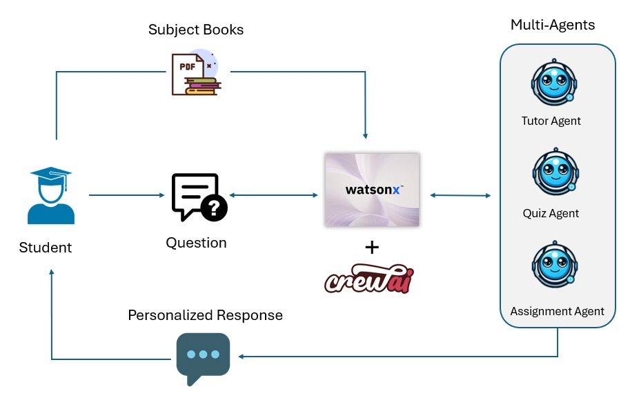
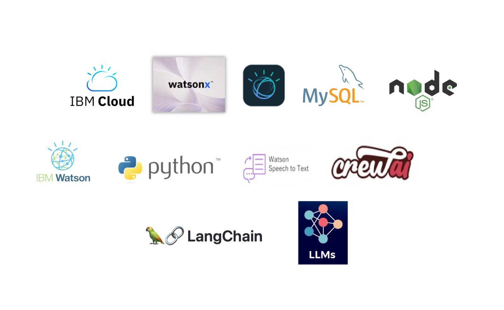

# MeraTutor

## Contents
1. [Introduction](#Introduction)
1. [Problem Statement](#Problem-Statement)
1. [Our Solution](#long-description)
1. [The Architecture](#architecture-overview)
1. [Demo Video](#demo-video)
1. [Live demo](#live-demo)
2. [Project Roadmap](#project-roadmap)
1. [Built With](#built-with)
1. [The Team](#team)
1. [License](#license)

## Introduction
Education is a fundamental right that has the potential to empower individuals, uplift communities, and drive societal progress. However, in many parts of the world, access to quality education is not universal, and even where it is available, significant gaps remain in inclusivity and equity. Students from disadvantaged backgrounds—whether due to socioeconomic status, location, disabilities, or other factors—often struggle to access personalized, quality education.

## Problem Statement

The current education system, while robust in many ways, often fails to address the individual learning needs of students. Major challenges include:

* **Inequitable Access**: Students from underserved communities or those with disabilities often don’t get the personalized resources or support they need to help with their learning challenges. This leads to learning gaps and missed opportunities for success.

* **Climate Change** : Natural disasters like floods, droughts, wildfires etc, made worse by climate change disturb education by damaging schools, forcing families to move, and causing temporary school closures. Vulnerable communities are hit the hardest, making it harder for kids to continue their education.

* **Transportation Barriers**: In remote areas, students struggle to reach schools because of long distances, poor roads, or lack of affordable transport. Disasters like floods or landslides make getting to school even harder.

* **Lack of Personalized Learning**: Many students find it difficult to keep up in traditional classrooms because lessons aren’t designed to match their learning pace or style.
    
* **Resource Constraints**: Teachers often have large class sizes and limited time, making it hard to give each student the individual attention they need.
    
* **Assessment Gaps**: Traditional assessments don’t offer immediate feedback on how well a student understands a topic and fail to adapt to individual learning needs.

## Our Solution

MeraTutor is a smart AI-powered virtual teacher designed to help students learn in a way that fits their needs, making education accessible for everyone. It aims to solve the problems in the current education system, especially for students from underserved communities or those with special needs, by providing a personalized learning experience that adapts to each student’s situation.

By leveraging the power of Generative AI, our solution(MeraTutor) aims to bridge the educational divide, ensuring that students in vulnerable communities receive the quality education they deserve. This solution not only helps prevent learning loss during critical times but also empowers students to take control of their learning journey. Ultimately, we envision a future where every child, regardless of their circumstances, has access to engaging, personalized, and effective education, enabling them to thrive academically and beyond.

Our solution(MeraTutor) centers around an innovative AI-powered virtual teacher designed to address the educational disruptions faced by students in vulnerable communities, particularly those impacted by climate change, conflict, or economic hardship. This virtual teacher provides a dynamic and interactive learning experience that ensures continuous education, even when students cannot physically attend school.

**Key Features of Our Solution**:

**Personalized Learning Experience**: The virtual teacher tailors lessons to each student’s individual learning style and pace. By analyzing responses and performance data, it identifies areas where students may struggle and adapts the content accordingly. This personalization helps ensure that all students grasp the material, regardless of their starting point.

**Interactive and Engaging Content**: Learning is made enjoyable through a variety of interactive activities, including quizzes. This kind of approach keeps students motivated and engaged, encouraging them to participate actively in their education.

**Continuous Access to Education**: With our virtual teacher, students can access learning materials anytime and anywhere, overcoming barriers posed by school closures or geographic isolation. This flexibility allows them to continue their studies at their convenience, ensuring they don’t fall behind.

**Feedback and Assessment**: The virtual teacher provides immediate feedback on quizzes, helping students understand their mistakes and learn from them. This instant feedback loop fosters a growth mindset and encourages continuous improvement.

**Content Adaptation for Understanding**: If a student struggles with a topic, the virtual teacher can deliver the same lesson in a different, more comprehensible manner. It can present information using various formats, such as videos, diagrams, or simplified explanations, catering to diverse learning preferences.

**Assignments and Reinforcement**: After each lesson, the virtual teacher provides relevant assignments tailored to reinforce what students have learned. These tasks help solidify knowledge and ensure that students can apply their understanding in practical contexts.

### Architecture Overview

How MeraTutor works:

1. Student ingests the books and study material into the MeraTutor. 

2. The student then asks the question.

3. Based on the question the appropriate Subject teacher (AI agent) is called to answer the question. 

4. These AI agents get their power from IBM watsonx LLM.

5. After that, the student can use another AI agent to play a Quiz to check his knowledge. The agent also provides score and feedback based on the answers.

6. The Student can finally find assignments that are created based on the concepts he learned.

## Demo video

## Live Demo
[MeraTutor App Link](https://meratutorai.pythonanywhere.com/)

## Project roadmap

## Built with

Clone the repository

$ git clone https://github.com/MeraTutor/MeraTutor-Webapp.git

$ cd MeraTutor-Webapp/

$ python3 app.py 

In Browser run with 127.0.0.1:5000

## Team

- [Suneetha Jonnadula](https://github.com/Sunivihaan) - _Lead Full Stack developer_
- [Prashanth P](https://github.com/Prashanthp) - _Principal Application developer_
- [Mohamed Fazil](https://github.com/Fazil-24) - _AI / ML Development Engineer_
- [Bharathi Athinarayanan](https://github.com/rathisoft) - AI / ML architect_ 

### License
This project is licensed under the Apache 2 License - see the [LICENSE](LICENSE) file for details.

